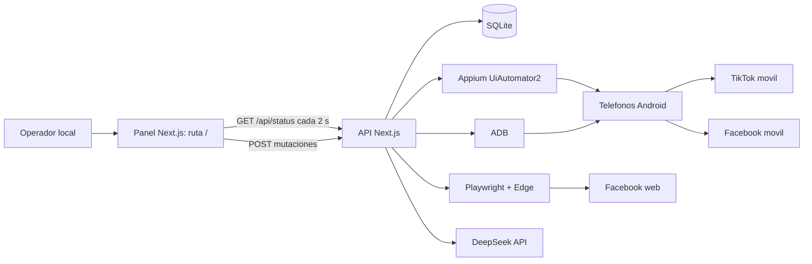
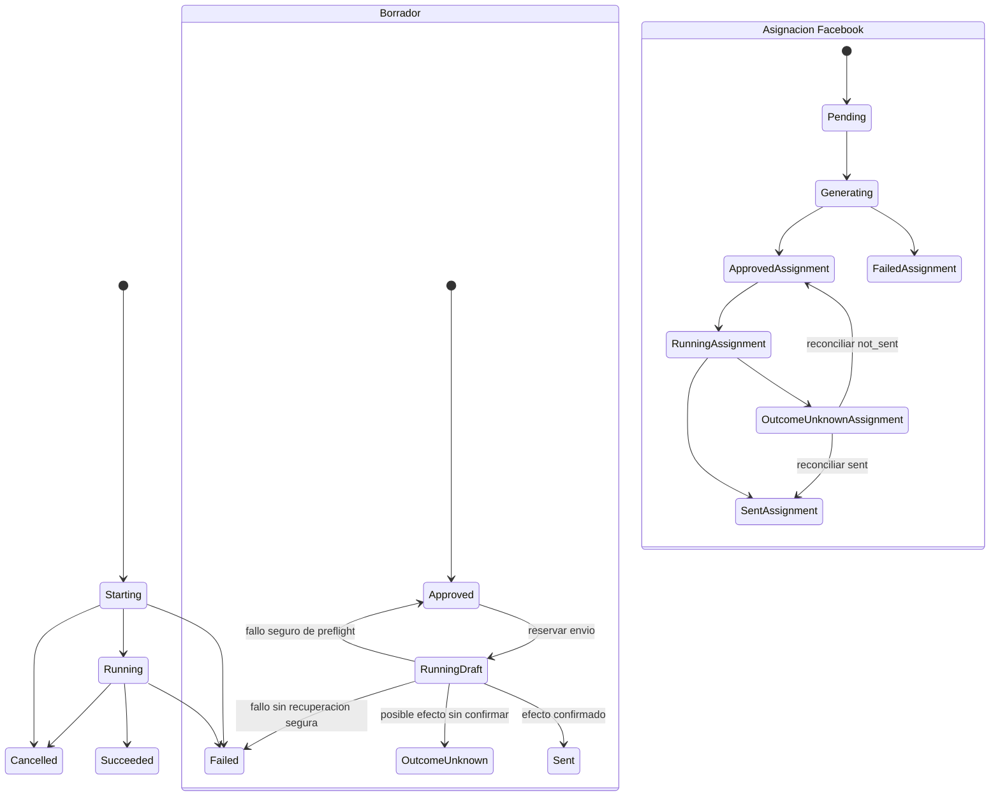
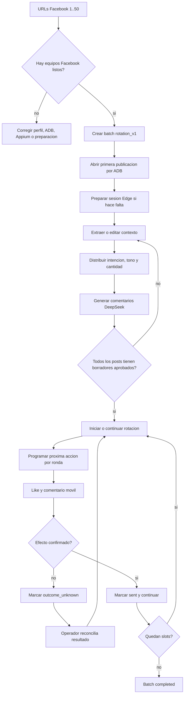

# Analisis funcional de farm-auto

Fecha de analisis: 2026-09-02

## 1. Proposito y alcance

`/home/joel/git/farm-auto` es un panel de control local para operar varios telefonos Android. Combina:

- ADB para detectar equipos, abrir/cerrar aplicaciones y preflight.
- Appium + UiAutomator2 + WebdriverIO para interactuar con la UI Android.
- Playwright + Microsoft Edge con perfil persistente para iniciar sesion y leer contexto de publicaciones Facebook.
- DeepSeek, por API compatible con OpenAI, para generar comentarios.
- SQLite para perfiles de telefonos, operaciones, locks, borradores y campanas Facebook.

No hay usuarios, autenticacion de aplicacion, roles, nube ni trabajo en segundo plano de servidor. La aplicacion esta pensada para ejecutarse en la misma maquina que Appium, ADB y los telefonos conectados.

Este documento describe el comportamiento confirmado en el codigo actual. Las conclusiones que no se pueden probar sin ejecutar hardware real se marcan como **Inferencia**.

## 2. Arquitectura y limites del sistema



El panel y Appium son procesos distintos y ambos se restringen a loopback:

- Next.js: `127.0.0.1` en desarrollo y produccion.
- Appium: `127.0.0.1:4723`, driver UiAutomator2.
- Las llamadas mutables a `/api/*` deben venir de origen local y llevar `X-Control-Panel-Client: control-panel`.
- `GET /api/status` es dinamico y se consulta al abrir el panel y luego cada dos segundos.

Fuentes: `package.json`, `README.md`, `src/proxy.ts`, `src/lib/request-security.ts`, `src/app/api/status/route.ts`.

## 3. Arranque operativo

### Requisitos locales

- Node.js 24 y npm 10 o superior.
- JDK compatible, `JAVA_HOME`, Android SDK, Platform Tools y `ANDROID_HOME` o `ANDROID_SDK_ROOT`.
- `adb` disponible por `ADB_PATH` o `PATH`.
- Telefonos Android por USB con depuracion autorizada.
- Microsoft Edge para la sesion Facebook.
- `APPIUM_HOME` no definido.

### Secuencia de inicio

1. Instalar dependencias con `npm ci`.
2. Ejecutar `npm run appium:doctor` para comprobar UiAutomator2 y el entorno Android.
3. Crear `.env` desde el ejemplo sin incluir secretos en el repositorio.
4. Arrancar Appium en una terminal: `npm run appium:server`.
5. Arrancar el panel en otra terminal: `npm run dev` o, tras compilar, `npm start`.
6. Abrir `/` desde la misma maquina.
7. El panel obtiene el snapshot de estado; solo despues se sabe que dispositivos son utilizables.

La aplicacion no arranca, reinicia ni apaga Appium automaticamente.

### Configuracion efectiva

| Variable | Uso | Valor por defecto o regla |
| --- | --- | --- |
| `APPIUM_URL` | URL del servidor Appium | `http://127.0.0.1:4723`; solo HTTP(S) loopback, sin credenciales. |
| `ADB_PATH` | Ejecutable ADB | Se usa `PATH` si no se define. |
| `CONTROL_PANEL_DB_PATH` | SQLite | `data/control-panel.sqlite`. |
| `API_DEEPSEEK` | Credencial DeepSeek | Sin valor: se bloquea la generacion. |
| `DEEPSEEK_MODEL` | Modelo de generacion | `deepseek-v4-flash`. |
| `DEEPSEEK_GENERATION_CONCURRENCY` | Concurrencia LLM | Entero positivo, limitado a 4. |
| `COMMENT_GENERATION_PROMPT` | Instruccion base para comentarios | Prompt local peruano/casual predeterminado. |
| `COMMENT_MIN_WORDS` | Minimo de palabras | 3 por defecto. |
| `COMMENT_MAX_WORDS` | Maximo de palabras | 15 por defecto y nunca menor que el minimo. |
| `FACEBOOK_BROWSER_EXECUTABLE_PATH` | Ejecutable Edge opcional | Resolucion automatica de Playwright/Edge si no se indica. |
| `FACEBOOK_BROWSER_PROFILE_PATH` | Perfil persistente de Facebook | `%LOCALAPPDATA%/farm-auto/facebook-browser-profile` en Windows; en Linux, `$XDG_DATA_HOME` o `~/.local/share`. |

Fuentes: `README.md`, `src/lib/config.ts`.

## 4. Rutas, navegacion y estado visual

Solo existe una pantalla Next.js: `/`. El contenido interno se cambia por hash, no por navegacion de rutas.

| Hash | Espacio de trabajo | Funcion |
| --- | --- | --- |
| `#open-social-content` | Abrir contenido | Valor inicial. Abre una URL sin reaccionar. |
| `#device-home` | Pantalla de inicio | Lleva Android al launcher. |
| `#facebook-post-like-comment` | Facebook | Gestiona una cola y rotacion de publicaciones. |
| `#tiktok-live-tap-tap` | TikTok Live | Ejecuta doble toque en coordenadas. |
| `#tiktok-post-like-comment` | TikTok post | Genera y envia un comentario con like. |
| `#dispositivos` | Dispositivos | Gestiona perfiles y preparacion. |
| `#actividad` | Actividad | Historial de operaciones. |

Los cinco espacios de trabajo permanecen montados y los inactivos se ocultan con `hidden`; cambiar modulo no descarta los valores locales hasta recargar. El selector usa `history.replaceState`, por lo que no agrega entradas al historial del navegador.

La navegacion superior tiene cuatro destinos:

- **Operar**: activa Abrir contenido y desplaza a la zona operativa.
- **Facebook**: activa la campana Facebook y desplaza a la zona operativa.
- **Dispositivos**: desplaza a `#dispositivos`.
- **Actividad**: desplaza a `#actividad`.

### Snapshot de estado

`GET /api/status` entrega, como minimo:

- Salud y version de Appium.
- Configuracion/disponibilidad de DeepSeek.
- Estado de la sesion Facebook de Edge.
- Dispositivos encontrados por ADB, sus paquetes instalados y foco actual.
- Perfiles fisicos y estado de preparacion.
- Borradores recientes.
- Operaciones recientes.
- Estado completo de la campana Facebook activa.

Si falla una consulta periodica, la UI conserva el ultimo snapshot valido. Si el dispositivo seleccionado desaparece del snapshot, se selecciona el primer dispositivo ADB en estado `device` y se elimina de la seleccion de preparacion. Un perfil que siga presente pero este `disconnected` conserva su seleccion actual.

**Importante:** este GET sincroniza perfiles Facebook configurados para equipos conectados, por lo que no es estrictamente de solo lectura.

## 5. Elementos comunes del panel

### Cabecera

- Marca: `AP / Control local`.
- Indicador Appium: `Comprobando conexion`, `Appium <version>` o `Appium sin conexion`.
- El punto visual cambia cuando Appium esta sano.

### Control global

El panel anuncia "Una accion clara por vez" y muestra modelo DeepSeek y disponibilidad. Un control de ayuda explica que se generan comentarios dentro del rango configurado y que publicar necesita una accion explicita.

El boton **Abortar todos los procesos** se habilita si existe una operacion Android activa, una generacion/extraccion Facebook, una rotacion corriendo o una operacion SQLite en `starting`/`running`. Cancela el `AbortController` del cliente y llama a `POST /api/processes/abort-all`.

### Dispositivo activo

Un selector muestra todos los dispositivos conocidos:

- Con perfil: `#orden - alias - serial`.
- Sin perfil: `Pendiente de incorporar - serial`.
- Sin dispositivos: `Sin dispositivos`.

Tambien muestra en solo lectura perfil, preparacion y paquete Android en primer plano. Las automatizaciones individuales usan este equipo; Facebook arma sus participantes por campana.

### Avisos y bloqueo de acciones

- Exito usa `role="status"`.
- Error usa `role="alert"`.
- Ambos pueden cerrarse manualmente.
- `busy` es global para la accion en curso: limpia aviso anterior, bloquea controles relacionados, refresca snapshot y muestra el resultado/error.

## 6. Pantallas y flujos funcionales

### 6.1 Selector de automatizaciones

Cinco tarjetas seleccionan el modulo. La disponibilidad se calcula usando el dispositivo activo, pero solo deshabilita los botones internos: no impide abrir una tarjeta.

| Codigo | Modulo | Requisito que muestra |
| --- | --- | --- |
| HM | Pantalla de inicio | Preparacion del dispositivo activo. |
| AB | Abrir contenido | Preparacion y TikTok/Facebook instalado. |
| FB | Like y comentario Facebook | Preparacion/capacidad como senal; la campana calcula sus equipos. |
| LV | Tap tap controlado | Preparacion y TikTok instalado. |
| TK | Like y comentario TikTok | Preparacion y TikTok instalado. |

Cada tarjeta informa disponibilidad y usa `aria-pressed` para indicar la seleccion.

### 6.2 HM: Pantalla de inicio

**Objetivo:** terminar el contexto actual y volver Android al launcher. No publica ni modifica contenido social.

Controles y reglas:

- Muestra dispositivo seleccionado y preparacion Appium.
- Boton **Ir a inicio ahora**; cambia a `Volviendo...` durante la accion.
- Se deshabilita si no hay dispositivo, no esta preparado o hay accion ocupada.
- Envia `deviceId` e `idempotencyKey` UUID a `POST /api/automations/home`.
- Backend: pulsa Home y confirma que el paquete foreground sea el launcher esperado.

### 6.3 AB: Abrir contenido sin interactuar

**Objetivo:** abrir una URL en TikTok o Facebook sin likes, comentarios, mensajes ni tap tap.

Controles:

- Selector segmentado TikTok/Facebook, inicialmente TikTok; muestra `Instalado` o `No instalado` y usa `aria-pressed`.
- Campo URL obligatorio, `type="url"`, maximo 2048 caracteres, placeholder por plataforma.
- Indicadores de preparacion y aplicacion instalada.
- Boton **Abrir sin interactuar en TikTok/Facebook**, con estado `Abriendo...`.

Reglas:

- El boton se deshabilita con accion activa, dispositivo no preparado o aplicacion ausente.
- El servidor acepta HTTPS, bloquea credenciales, puertos distintos de 443, comillas y caracteres de control.
- TikTok solo admite `tiktok.com` o subdominios.
- Facebook solo admite `facebook.com`, `fb.watch` o subdominios.
- Se elimina fragmento; Facebook normaliza el host a `www.facebook.com`.
- La automatizacion abre el enlace y verifica que la app elegida quede en foreground.

### 6.4 LV: TikTok Live, tap tap controlado

**Objetivo:** realizar rondas de doble toque sobre un live de TikTok en coordenadas concretas.

Controles:

- Previsualizacion vertical con el punto de toque y `aria-label` de coordenadas.
- URL obligatoria, `type="url"`, maximo 2048 caracteres.
- Rondas: entero 1 a 50, inicial 10.
- X: entero 0 a 5000, inicial 540.
- Y: entero 0 a 5000, inicial 960.
- Resumen de cantidad: `rondas x 2` toques.
- Boton **Iniciar N rondas**, con estado `Ejecutando tap tap...`.

Reglas:

- Requiere dispositivo preparado y TikTok instalado.
- El backend exige una URL TikTok Live con `@usuario`, verifica el objetivo y aplica un gesto de doble toque por ronda.
- La vista limita visualmente el punto a un lienzo de referencia 1080 x 2400, pero la ejecucion recibe los valores originales.

### 6.5 TK: TikTok, like y comentario generado

Este modulo tiene tres pasos visibles.

#### Paso 1: destino

- Campo de enlace HTTPS obligatorio, maximo 2048.
- Mensaje de que el destino esta bloqueado a TikTok.
- Indicadores: automatizacion preparada, TikTok instalado y enlace ingresado.

#### Paso 2: generacion

- **Contexto real**: textarea obligatorio, 5 a 1200 caracteres.
- **Intencion**: texto obligatorio, 3 a 300 caracteres.
- **Tono**: selector con diez valores: Casual, Amable, Curioso, Entusiasta, Dulce / Calido, Empatico / Asertivo, Distante / Formal, Pasivo-Agresivo / Sarcastico, Frio / Cortante y Defensivo / Agresivo.
- Boton **Generar borrador con DeepSeek**; muestra `Redactando...`.
- Se bloquea si hay accion en curso o falta configuracion DeepSeek.
- Lista hasta tres borradores TikTok recientes; pulsar uno lo carga para revision.

El enlace no forma parte del formulario de generacion. La generacion solo exige contexto, intencion y tono, pero el envio exige tambien enlace valido.

#### Paso 3: revision y envio

- Muestra estado, fecha en `es-PE`, texto de solo lectura y contador `/500`.
- **Nuevo borrador** limpia seleccion y texto.
- Si esta `approved`, permite **Copiar texto** con `navigator.clipboard` y **Dar like y comentar en TikTok**.
- El envio se bloquea si falta URL, preparacion, TikTok instalado o hay accion activa.
- `sent` informa completado y evita repeticion visual; `failed` pide crear otro borrador; otros errores aparecen inline.

Al enviar, el servidor reserva el borrador, conserva el like existente o lo registra, abre el compositor, verifica el texto, envia y confirma su visibilidad. Si hubo posible efecto publico pero no puede confirmarse, marca `outcome_unknown` y no reintenta.

### 6.6 FB: Facebook, cola y rotacion multidispositivo

Es el flujo mas complejo. Tiene una rama actual `rotation_v1` y conservacion de comportamiento para lotes `legacy` que puedan persistir en SQLite.

#### A. Crear o reemplazar cola

Se ve cuando no hay lote activo o se pulsa **Reemplazar cola**.

- Textarea con hasta 50 enlaces Facebook, una URL por linea.
- Cliente elimina duplicados conservando orden; servidor normaliza URL de nuevo.
- Lista los equipos Facebook configurados con alias, serial y estado `Listo`/`Requiere preparacion`.
- No se eligen equipos manualmente: la nueva rotacion toma todos los participantes elegibles.
- Muestra `listos / configurados` y mensajes si hay mas de 50 URLs o no hay un participante preparado.
- Si ya existe lote activo aparece **Conservar cola actual**.
- **Crear rotacion de Facebook** requiere 1 a 50 URLs unicas y al menos un equipo preparado. En servidor, cada participante debe pertenecer a la configuracion estatica Facebook, estar conectado por ADB, tener identidad fisica no duplicada y Facebook instalado. El servidor persiste el lote y abre la primera publicacion asignada por ADB en los equipos.

No se puede reemplazar una cola si tiene ejecucion/generacion/extraccion activa, efectos publicos o reconciliaciones pendientes. Tampoco se permite reemplazarla cuando la rotacion ya realizo una accion publica.

#### B. Cola, rondas y equipos

- Cada publicacion se muestra como item numerado y seleccionable; la actual usa `aria-current="step"`.
- **Reemplazar cola** se deshabilita una vez hubo accion publica.
- Panel **Publicaciones abiertas**: una tarjeta por telefono de la ronda; muestra telefono, serial, numero de post, apertura, espera, reintento o enviado.
- **Reabrir** fuerza cerrar/abrir Facebook para un equipo y se bloquea durante ejecucion.
- Campo **Maximo de espera**: entero 0 a 1440 minutos, inicial 60.
- Boton **Iniciar rotacion** o **Continuar rotacion**.

Para iniciar, todos los comentarios requeridos para publicaciones no omitidas deben estar preparados, debe quedar al menos una asignacion `approved`, el tiempo debe ser valido y no puede haber resultados publicos inciertos. Cada telefono recorre todas las URL una vez; una ronda asigna cada equipo a una sola publicacion y programa su inicio aleatoriamente entre 0 y el maximo indicado.

**Inferencia:** el temporizador vive en el cliente. Al cerrar el panel, la planificacion queda persistida pero no avanza sola hasta otra llamada al endpoint; no existe worker o scheduler en servidor.

#### C. Sesion y contexto de la publicacion seleccionada

- Muestra `Publicacion N de M` y estado.
- Estado Edge/Facebook: `closed`, `login_required`, `ready` o `extracting`.
- Boton contextual: **Preparar Facebook**, **Mostrar login**, **Comprobar sesion** o `Comprobando sesion...`.
- Si Edge esta visible, boton **Cerrar navegador**.
- Link externo seguro de destino y boton **Obtener contexto** / `Leyendo descripcion...`.
- Textarea **Descripcion editable**, 5 a 1200 caracteres.

Playwright usa perfil persistente. En segundo plano verifica la cookie `c_user`; si falta, abre Edge visible para login/renovacion y lo cierra al detectarla. La extraccion expande `Ver mas`, lee texto publicado y bloquea redirecciones externas, login/checkpoint, publicaciones ambiguas, texto truncado o vacio.

La descripcion deja de poder editarse durante extraccion, generacion, aprobacion, ejecucion, completado, resultado incierto o cuando existen efectos bloqueados.

#### D. Distribucion y generacion de comentarios

En rotacion, los dispositivos estan fijados a la campana. En lotes legacy existe una lista de checkboxes para equipos elegibles.

Se configuran filas de distribucion:

- Intencion: campo con datalist.
- Tono: los diez tonos de TikTok.
- Cantidad: entero 1 a 100.
- **Agregar intencion** agrega Elogio o Apoyo, Dulce / Calido, cantidad 1.
- **Quitar** esta disponible si queda mas de una fila.
- El resumen `Distribuidos X / Y` debe coincidir exactamente.

Intenciones sugeridas:

- Ataque directo.
- Evitacion / Desvinculacion.
- Critica Constructiva.
- Afrontamiento Enfocado en el Problema.
- Desinformacion o Error Factual.
- Elogio o Apoyo.

**Generar todos en una llamada** requiere DeepSeek, contexto de al menos cinco caracteres, dispositivos y distribucion exacta. Tambien puede reintentar comentarios pendientes. Una vez iniciada generacion no permite reconfigurar la distribucion. El servicio pide todos los textos faltantes para una publicacion en una sola llamada LLM y los persiste como `approved`, sin aprobacion humana de redaccion.

#### E. Revision de resultados y ejecucion

- Una tarjeta por asignacion: dispositivo, intencion, tono, estado, comentario de solo lectura y error inline.
- Ante incertidumbre, selector de resultado observado: sin seleccionar, `El comentario si aparece` o `El comentario no aparece`.
- **Guardar verificacion** solo se activa si se indico resultado para todos los pendientes.
- En flujo legacy hay pausa minima y maxima, enteros 1 a 600 segundos, iniciales 15 y 45; maximo debe ser igual o mayor.
- Se puede **Omitir publicacion** solo bajo restricciones de estado; no despues de iniciar rotacion ni cuando hubo efecto publico.
- Un lote completo permite **Crear una nueva cola**.

Si la automatizacion no puede confirmar un efecto publico, `outcome_unknown` bloquea el avance. `sent` confirma envio; `not_sent` devuelve la asignacion a `approved` para reintento.

## 7. Gestion de dispositivos

### Incorporacion

La pantalla de dispositivos permite:

- Buscar por orden, alias, modelo o serial.
- **Seleccionar visibles** y **Limpiar seleccion**.
- Ver por fila estado `Listo`, `No listo`, `Preparando` o `Pendiente`.
- Elegir varios equipos para preparacion, salvo equipos sin perfil o mientras se esta preparando una seleccion.

El perfil del dispositivo activo exige:

- Alias: texto de 1 a 120 caracteres.
- Orden fisico: entero >= 0.
- `systemPort`: entero entre 8200 y 8299.
- Identidad fisica (`hardwareId`): se deriva de los componentes disponibles de `ro.serialno` y `android_id`.
- Serial de transporte ADB (`deviceId`): texto 1 a 120 caracteres.

Al guardar, hardware ID, transporte, orden fisico y `systemPort` deben ser unicos en el conjunto. Se usa **Incorporar dispositivo** para un perfil nuevo y **Actualizar perfil** para uno existente.

Cambiar `systemPort` de un equipo con lock produce conflicto. Cambiar transporte ADB (`deviceId`) tambien se bloquea si el equipo pertenece a una cola Facebook activa. Un cambio valido invalida la preparacion anterior.

### Preparacion

**Preparar N dispositivos** se ejecuta de forma secuencial. Por equipo valida:

1. Perfil registrado e identidad fisica coincidente.
2. Dispositivo ADB conectado/autorizado.
3. Salud de Appium.
4. Sesion UiAutomator2.
5. Jerarquia accesible Android con `<hierarchy>`.
6. Retorno confirmado a Inicio.

Una automatizacion requiere estado `ready` y revision de preparacion `SETUP_REVISION = 1`. Al cambiar requisitos de setup se puede invalidar globalmente equipos antes listos.

La configuracion estatica `src/config/facebook-devices.json` declara 12 telefonos Facebook. El snapshot sincroniza un perfil de esa lista solo si ADB lo ve conectado, puede validar la identidad y no tiene que transferir silenciosamente un perfil a otro hardware.

## 8. Persistencia, concurrencia e idempotencia

SQLite activa WAL, claves foraneas y `busy_timeout = 5000`. La version de esquema del codigo es 11.

| Tabla | Responsabilidad |
| --- | --- |
| `device_profiles` | Perfil e identidad fisica de cada telefono; restricciones de unicidad. |
| `device_preparation` | Estado `running`, `ready` o `not_ready`, problema y revision. |
| `operations` | Operaciones individuales, fingerprint, clave idempotente, estado, resultado/error. |
| `device_locks` | Un lock por `device_id` para evitar acciones Android simultaneas. |
| `message_drafts` | Contexto, intencion, tono, texto y ciclo de borrador. |
| `facebook_batches` | Cola Facebook, plan, ronda, ejecucion y proxima fecha. |
| `facebook_posts` | URL, contexto y estado de cada post del lote. |
| `facebook_assignments` | Relacion post-dispositivo, texto y resultado. |
| `facebook_rotation_slots` | Mapa post/dispositivo/ronda/orden y programacion de apertura. |
| `control_panel_runtime` | Propiedad de runtime para recuperacion tras reinicio. |

### Operaciones individuales

Para HM, AB y LV se crea un registro con SHA-256 de `{ kind, deviceId, request }` y una clave UUID de idempotencia:

- Misma clave con solicitud distinta: rechazo.
- Operacion exitosa repetida: devuelve resultado persistido.
- `starting` o `running`: responde `OPERATION_IN_PROGRESS`.
- `failed` o `cancelled`: no reintenta automaticamente.
- Antes de la sesion Appium toma lock por equipo; al confirmar cleanup lo libera.

Cada sesion usa UiAutomator2, `noReset`, `autoLaunch: false`, `systemPort` del perfil y timeout explicito. No pueden coexistir sesiones sobre el mismo serial o puerto. Si no puede confirmar cierre de sesion, el dispositivo queda bloqueado como `DEVICE_CLEANUP_UNKNOWN`.

Ante error con sesion viva almacena screenshot, XML y metadatos en `data/appium-artifacts/<operacion>/`.

### Recuperacion y efectos publicos

Al detectar reinicio del runtime:

- Operaciones activas pasan a fallo.
- Preparaciones activas pasan a `not_ready`.
- Ejecuciones que pudieron publicar se degradan a `outcome_unknown` o fallo parcial para verificacion humana.

Antes de like o comentario guarda un checkpoint. Los errores de preflight demostrablemente sin efecto (ADB/Appium no disponible, app ausente, objetivo no verificado, timeout de elemento, setup requerido, lock o foreground incorrecto) son reintentables. Despues de una posible interaccion publica, el sistema evita reintento automatico.

## 9. Maquinas de estado



Estados mostrados por la UI:

| Entidad | Estados |
| --- | --- |
| Preparacion | `running`, `ready`, `not_ready`. |
| Operacion | `starting`, `running`, `succeeded`, `failed`, `cancelled`. |
| Borrador | `draft`, `approved`, `running`, `sent`, `failed`, `outcome_unknown`. |
| Navegador Facebook | `closed`, `login_required`, `ready`, `extracting`. |
| Post Facebook | `queued`, `extracting`, `context_ready`, `generating`, `drafts_ready`, `approving`, `approved`, `running`, `completed`, `partial_failed`, `outcome_unknown`, `skipped`. |
| Asignacion Facebook | `pending`, `generating`, `draft`, `approved`, `running`, `sent`, `failed`, `outcome_unknown`. |
| Batch Facebook | `active`, `completed`, `cancelled`; ejecucion `idle` o `running`. |

Transiciones relevantes Facebook:

- Un post pasa de `queued` a extraccion/contexto, generacion y aprobacion antes de poder ejecutar; puede quedar `partial_failed` o `skipped` antes de efectos publicos.
- La ejecucion puede terminar `completed` o `outcome_unknown`. Este ultimo exige reconciliar cada asignacion antes de volver a ejecutar.
- El batch avanza por slots/rondas solo cuando no existen resultados inciertos y termina en `completed` al agotar los slots no omitidos.

## 10. Flujo extremo a extremo

### Flujo individual seguro

1. Abrir `/`; el modulo AB es inicial.
2. Detectar por ADB o incorporar un telefono con perfil fisico.
3. Seleccionarlo y prepararlo.
4. Elegir HM, AB, LV o TK.
5. Completar los campos habilitados por la disponibilidad.
6. Ejecutar; el backend valida, toma lock, registra operacion, crea sesion Appium y realiza el flujo.
7. Consultar aviso y Actividad; si hay riesgo de efecto publico no confirmado, verificar manualmente antes de repetir.

### Flujo TikTok post

1. Elegir TK y registrar URL destino.
2. Ingresar contexto, intencion y tono.
3. Generar borrador en DeepSeek.
4. Seleccionar/revisar el texto, que ya llega `approved`.
5. Copiar o enviar explicitamente like + comentario.
6. Revisar `sent`, `failed` u `outcome_unknown`.

### Flujo Facebook de rotacion



## 11. API HTTP

Todas las respuestas exitosas siguen `{ "success": true, "data": ... }`. Los errores normalizados siguen `{ "success": false, "code", "message", "details" }`. Zod devuelve `400 VALIDATION_ERROR`; errores de dominio conservan status/codigo; excepciones imprevistas son `500 INTERNAL_ERROR`.

| Metodo | Endpoint | Entrada | Comportamiento |
| --- | --- | --- | --- |
| GET | `/api/status` | - | Snapshot integral del panel. |
| POST | `/api/setup` | `deviceId` | Prepara un equipo. |
| POST | `/api/device-profiles` | `profiles[]` | Crea o actualiza perfiles. |
| POST | `/api/automations/home` | `deviceId`, UUID | Lleva Android a Home. |
| POST | `/api/automations/open-content` | `deviceId`, UUID, plataforma, URL | Abre contenido sin interactuar. |
| POST | `/api/automations/tiktok-live` | `deviceId`, UUID, URL, rondas, X, Y | Ejecuta doble toque Live. |
| GET | `/api/operations/:id` | ID | Lee una operacion. |
| DELETE | `/api/operations/:id` | ID | Solicita cancelacion. |
| POST | `/api/processes/abort-all` | - | Cancela operaciones, LLM, extraccion y batch. |
| GET | `/api/messages` | - | Lista hasta 100 borradores. |
| POST | `/api/messages/draft` | Brief social | Genera un borrador aprobado. |
| POST | `/api/messages/:id/send` | `deviceId`, URL requerida semanticamente | Publica like + comentario individual. El esquema la declara opcional, pero el servicio rechaza su ausencia. |
| GET | `/api/facebook/browser` | - | Lee estado Edge/Facebook. |
| POST | `/api/facebook/browser` | `open` o `close` | Abre/cierra sesion Edge. |
| POST | `/api/facebook/batches` | URLs, dispositivos | Crea rotacion y abre primera ronda. |
| POST | `/api/facebook/batches/:id/execute` | maximo de espera | Ejecuta el paso/ronda disponible. |
| POST | `/api/facebook/batches/:id/devices/:deviceId/reopen` | - | Reabre Facebook del equipo. |
| POST | `/api/facebook/posts/:id/extract` | objeto vacio estricto | Extrae descripcion autenticada. |
| POST | `/api/facebook/posts/:id/drafts` | contexto, equipos, asignaciones | Genera comentarios. |
| DELETE | `/api/facebook/posts/:id/drafts` | - | Cancela generacion. |
| POST | `/api/facebook/posts/:id/execute` | pausas min/max | Ejecuta flujo legacy. |
| POST | `/api/facebook/posts/:id/reconcile` | outcomes | Guarda verificacion manual. |
| POST | `/api/facebook/posts/:id/skip` | - | Omite post cuando el estado lo permite. |

## 12. Validaciones que una reimplementacion debe preservar

| Campo o regla | Validacion |
| --- | --- |
| `deviceId` | Texto recortado de 1 a 120 caracteres. |
| Clave idempotente | UUID. |
| Perfil | 1 a 100 filas; `hardwareId` 1..240, alias 1..120, orden entero >= 0, puerto entero 8200..8299; hardware, serial, orden y puerto unicos. |
| URL social | URL Zod, maximo 2048; HTTPS, sin credenciales, sin puerto salvo 443, sin caracteres de control/comillas, host permitido, sin fragmento. |
| TikTok Live | Rondas 1..50; X/Y enteros 0..5000; URL Live valida. |
| Brief LLM | Contexto 5..1200; intencion 3..300; plataforma TikTok/Facebook; tono del enum. |
| Respuesta LLM | JSON con cantidad exacta, cada texto 2..500 caracteres y dentro del rango configurado de palabras. Soporta JSON puro, bloque `json` o objeto extraido. |
| Batch Facebook | 1..50 URLs, 1..100 dispositivos sin repetidos. |
| Asignaciones Facebook | 1..20 filas; cada cantidad 1..100; suma exacta de cantidades = equipos; sin dispositivo repetido. |
| Pausa legacy | Min/max enteros 1..600 y max >= min. |
| Espera rotacion | Entero 0..1440 minutos. |
| Reconciliacion | 1..100 outcomes, UUID de asignacion, `sent`/`not_sent`, sin IDs repetidos. |

## 13. Generacion LLM y cancelacion

- Endpoint DeepSeek: `https://api.deepseek.com`.
- Timeout: 45 segundos.
- Temperatura: 0.85.
- Concurrencia global maxima: 4.
- Para Facebook genera todos los comentarios de un post en una sola peticion, manteniendo el orden.
- Reintenta hasta tres veces ante red, 408, 409, 429, 5xx, contenido vacio, JSON invalido o rango de palabras incorrecto.
- Respeta `retry-after-ms` o `retry-after`; de no existir, espera con backoff aleatorio limitado a 8 segundos.
- `AbortSignal` cancela solicitud y espera.
- 401 se traduce a `503 DEEPSEEK_AUTH_FAILED`; 429 a `502 DEEPSEEK_RATE_LIMIT`; otros fallos a `502 DEEPSEEK_ERROR`.
- El aborto global cancela Appium, DeepSeek, Playwright y batch.

## 14. Seguridad y criterios de fallo seguro

- No existen login, usuarios ni permisos de aplicacion. La frontera de seguridad es que el panel solo opera en loopback.
- Para mutar, el proxy exige host local, header de cliente, origen permitido o ausente, y `Sec-Fetch-Site` `same-origin`/`none`.
- El perfil Edge se guarda fuera del repositorio.
- Appium rechaza URL remota y credenciales en URL.
- No se reintenta una posible accion publica sin verificacion manual.
- El navegador web Facebook solo lee contexto; likes y comentarios se hacen desde la app movil mediante Appium.

Riesgo de borde confirmado en codigo: si Facebook publica correctamente pero falla despues el cierre por ADB, ese fallo puede clasificarse como reintentable y devolver el borrador a `approved`. Una reimplementacion debe registrar el checkpoint de efecto antes de cualquier limpieza para no repetir una publicacion exitosa.

## 15. Actividad, responsive y accesibilidad

### Actividad

Muestra hasta ocho operaciones recientes con indicador, nombre amistoso, `device_id`, error, fecha `es-PE`, estado y boton **Detener** para `starting`/`running`. Sin registros muestra `La primera ejecucion aparecera aqui`. Indica SQLite y ultimo `polledAt`.

### Responsive

- Contenedor central de maximo 1240 px, fondo calido y cabecera sticky.
- <= 1080 px: seleccion de dispositivo/preparacion pasa a dos columnas; modulos a tres columnas.
- <= 860 px: cabecera y workspaces se apilan.
- <= 640 px: navegacion superior en dos columnas; modulos y formularios en una; cola Facebook conserva scroll horizontal.
- Respeta `prefers-reduced-motion: reduce`.

### Accesibilidad confirmada

- Documento `lang="es"`, semantica `main`, `header`, `nav`, `section`, labels y headings.
- Tooltips accionables por mouse, foco y clic; cierre con Escape, blur o salida del cursor.
- Botones segmentados y modulos usan `aria-pressed`; pasos usan `aria-current`.
- Inputs nativos con tipos, required, min y max.
- Avisos `status`/`alert`, preparacion con `aria-live="polite"`, foco visible y reduced motion.

No se encontro enlace explicito para saltar al contenido ni pruebas automatizadas completas de teclado/lector de pantalla.

## 16. Pruebas y evidencia de ejecucion

Comandos disponibles:

```text
npm run lint
npm run typecheck
npm test
npm run build
npm run check
npm run test:e2e:appium
npm run test:e2e:appium:destructive
```

Cobertura unitaria actual: acciones Android, parser XML UiAutomator2, Appium/sesiones/cancelacion, migraciones SQLite, selectores Facebook/TikTok, validaciones, rotacion y seguridad de origen.

E2E smoke, solo con `RUN_APPIUM_E2E=1`:

- Valida dispositivos y puertos.
- Crea sesion por equipo de forma secuencial.
- Lee jerarquia, vuelve Home, abre deep link inocuo, verifica foreground y vuelve Home.

E2E destructivo, solo con `RUN_APPIUM_DESTRUCTIVE=1` y variables controladas:

- TikTok Live con doble toque.
- TikTok post con like y comentario.
- Facebook post con like y comentario.

Durante la exploracion reportada, `npm test` paso 54/54 y lint paso. `npm run typecheck` fallo porque `.next/types` estaba desactualizado e importaba rutas eliminadas (`approve`). No se limpio ni recompilo el proyecto analizado para no modificarlo. Los E2E fisicos no se ejecutaron y no hay evidencia de una ejecucion reciente sobre telefonos reales.

## 17. Datos locales y migraciones

El repositorio no entrega seeds reproducibles. `data/` es local/ignorado y contenia SQLite y backups sin filas operativas. La base principal se encontro en `user_version=8` mientras que el codigo espera 11.

**Inferencia de alta confianza:** el siguiente arranque aplica migraciones 8 -> 9 -> 10 -> 11. La migracion 9 -> 10 borra locks, slots, asignaciones, posts, batches, borradores, operaciones y preparacion, manteniendo perfiles. Aunque no habia filas que perder en la inspeccion, una reimplementacion debe definir explicitamente su politica de migracion y recuperacion antes de usar datos reales.

## 18. Prioridades para una reimplementacion

1. Construir primero el nucleo local: perfiles, preparacion, ADB, Appium, locks, idempotencia, operaciones y artefactos de fallo.
2. Mantener la semantica `outcome_unknown` y reconciliacion manual para cualquier efecto publico no confirmable.
3. Implementar HM y AB antes de interacciones sociales; son los mejores flujos de prueba de conectividad, deep links y foreground.
4. Implementar TK/LV sobre una sola unidad preparada y con E2E controlado.
5. Separar lectura Facebook (Playwright/Edge) de interaccion movil (Appium).
6. Agregar batches/rotacion cuando el ciclo individual sea estable; decidir si la programacion debe pasar a un worker de servidor. El sistema actual depende del navegador abierto.
7. Crear CI, pruebas de handlers API, pruebas de servicio batch y fixtures de SQLite antes de operar a escala.

## 19. Mapa de fuentes analizadas

| Area | Archivos principales en `/home/joel/git/farm-auto` |
| --- | --- |
| UI | `src/app/control-panel.tsx`, `src/app/page.tsx`, `src/app/globals.css`, `src/app/layout.tsx`. |
| API | `src/app/api/**/route.ts`, `src/proxy.ts`. |
| Validacion/configuracion | `src/lib/schemas.ts`, `src/lib/config.ts`, `src/lib/errors.ts`, `src/lib/request-security.ts`. |
| Dispositivos/Appium | `src/lib/adb.ts`, `src/lib/appium.ts`, `src/lib/automation-service.ts`, `src/lib/automation-errors.ts`. |
| TikTok/Facebook movil | `src/lib/tiktok-automation.ts`, `src/lib/facebook-automation.ts`, `src/lib/messages.ts`. |
| Facebook web/rotacion | `src/lib/facebook-browser.ts`, `src/lib/facebook-batch-service.ts`, `src/lib/facebook-rotation.ts`, `src/lib/facebook-device-configuration.ts`. |
| Persistencia | `src/lib/db.ts`, `src/lib/db-migration.ts`. |
| Configuracion Facebook | `src/config/facebook-devices.json`. |
| Pruebas | `test/**/*.test.ts`, `e2e/appium/**/*.test.ts`. |
| Operacion | `README.md`, `package.json`, `next.config.ts`. |
